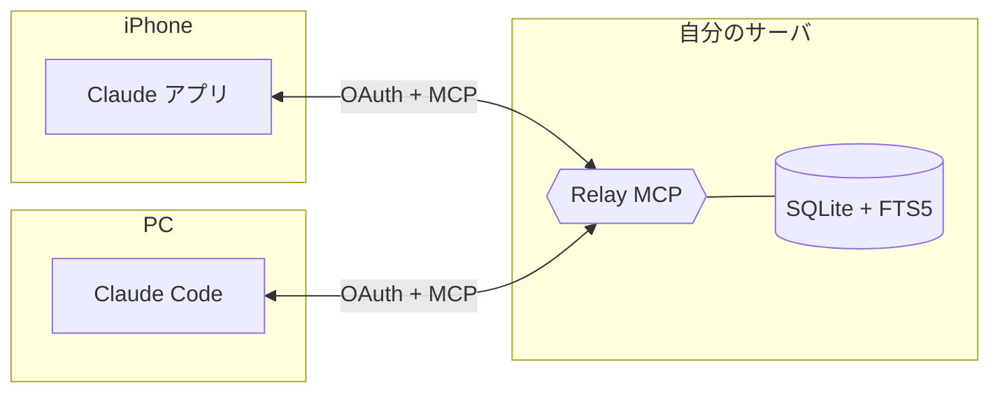

<p align="center"></p>

# Relay

[](https://github.com/kitepon-rgb/Relay/actions/workflows/typecheck.yml)
[](LICENSE)
[](https://nodejs.org)
[](https://modelcontextprotocol.io)

> セルフホストの MCP サーバ。iPhone の Claude アプリで交わした会話を、デスクトップの Claude Code で続きから再開できる。逆方向も同じ。会話の往復は Claude にやらせて、データは自分で持つ。

[English README →](README.md)

---

## 30 秒で何ができるか

自分のサーバで Relay を立ち上げ、iPhone と PC の Claude にカスタム Connector として登録する。あとはこんな感じ:

**iPhone 側**

> 「この会話を Relay に保存して」

Claude が会話を整え、タイトルを生成し、Relay の `append` を呼ぶ。これだけ。

**PC 側（Claude Code）**

> 「さっき iPhone で OAuth のリファクタについて話した会話を取ってきて」

Claude が `search` または `read_topic` を呼び、エントリを文脈に読み込む。続きから作業できる。

逆方向も同じツール、同じデータ、同じ手順。

## 既存の手段との違い

| 手段 | 双方向 | 転送を Claude にやらせられる | 後から検索できる | セルフホスト |
|---|:---:|:---:|:---:|:---:|
| コピペ / スクショ | ✓ | ✗（自分でやる） | ✗ | n/a |
| 自分宛てメール | ✓ | ✗ | 弱 | ✗ |
| メモアプリ同期（iCloud, Google Keep など） | ✓ | ✗ | 弱 | ✗ |
| Custom Connector → クラウド SaaS（Notion など） | ✓ | ✓ | ✓ | ✗ |
| **Relay** | **✓** | **✓** | **✓**（SQLite FTS5） | **✓** |

Relay は「もう 1 個メモアプリ」ではない。両方の Claude が読み書きできる**薄い共有ノートブック**。賢さは両端の Claude が持ち、Relay は保存だけ担当する。

## アーキテクチャ



- **トランスポート**: Streamable HTTP（MCP 仕様）
- **認証**: OAuth 2.1 + Dynamic Client Registration + PKCE + リフレッシュトークン rotation（reuse 検知付き）
- **ストレージ**: SQLite + FTS5、append-only。トークンと認可コードは `SHA-256(secret)` で保存、生値はディスクに残さない
- **識別子の 3 軸**: `source`（書き込んだ端末 = OAuth `client_id` から逆引き） / `title`（書き込み側の Claude が生成） / `id`（サーバ採番の UUID v7）

### MCP ツール

| ツール | 役割 |
|---|---|
| `append` | 会話スニペットを保存（title + content） |
| `list_topics` | タイトル一覧、source / since で絞り込み可 |
| `read_topic` | タイトル配下のエントリを新しい順で取得 |
| `search` | 本文 + タイトルの全文検索（FTS5） |
| `read_recent` | 時系列横断ビュー |
| `read_by_id` | 単一エントリ取得 |
| `list_sources` | 登録済み Connector 一覧 |

意図的に **edit / delete は無い**。append-only。消したくなったら SQLite ファイルを直接編集する。

## クイックスタート

```bash
git clone https://github.com/kitepon-rgb/Relay.git
cd Relay
cp .env.example .env
# 必須項目:
#   RELAY_PUBLIC_MCP_URL    MCP エンドポイントの公開 URL
#   RELAY_PUBLIC_AUTH_URL   OAuth サーバの公開ベース URL（同 origin）
#   RELAY_OAUTH_SIGNING_KEY  openssl rand -base64 64
#   RELAY_ADMIN_PASSCODE    consent ページで入力する passcode
docker compose up -d --build
```

TLS を終端するリバースプロキシ（Caddy / nginx / Traefik）を前段に置く。あとは iPhone と PC の Claude アプリで:

1. **カスタム Connector** を開く
2. **Remote MCP server URL** に `RELAY_PUBLIC_MCP_URL` を貼る
3. **OAuth Client ID / Secret** は**空のまま**（Claude が自分で DCR する）
4. Consent ページが 1 回だけ出るので passcode を入力

完了。リフレッシュトークンが切れる ~3 か月の間は再認可不要。

## 設定 / 運用 / 設計方針

リバースプロキシ構成、Hairpin-NAT 対応、バックアップ、Connector 失効、署名鍵ローテーション、設計方針（フォールバック禁止 / append-only / トークンハッシュ化）の詳細は [English README](README.md) を参照。

## ライセンス

[MIT](LICENSE).
