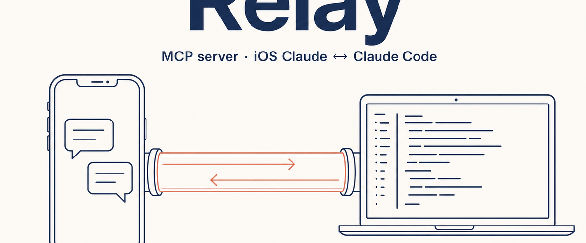
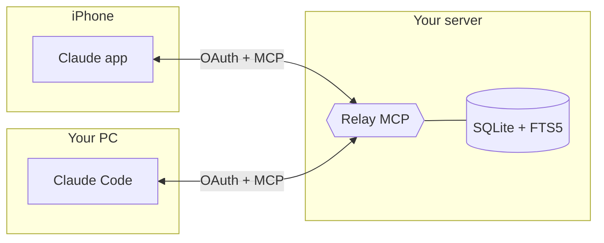
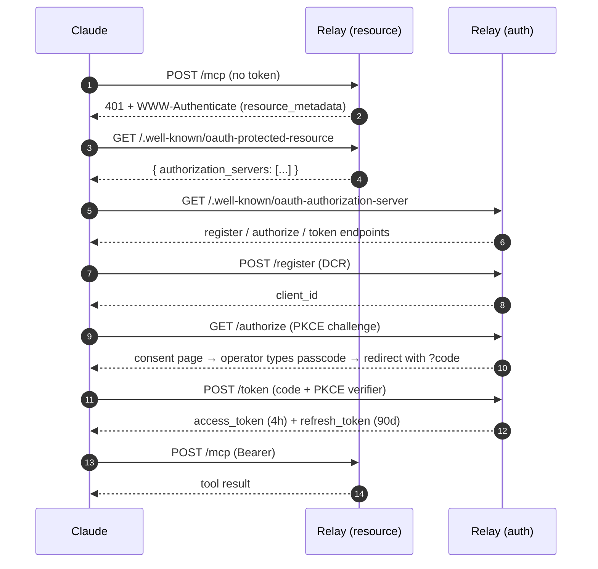

<p align="center"></p>

# Relay

[](https://github.com/kitepon-rgb/Relay/actions/workflows/typecheck.yml)
[](LICENSE)
[](https://nodejs.org)
[](https://modelcontextprotocol.io)

> Self-hosted MCP server. Save a Claude conversation on your iPhone, pick it up on your laptop in Claude Code — and the other way around. Claude does the transfer; you keep the data.

[日本語版 README →](README.ja.md)

---

## 30 seconds

You run Relay on a server you control. You register it as a Custom Connector in Claude on both your phone and your desktop. Then conversation feels like this:

**On the iPhone**

> "Save this conversation to Relay."

Claude transcribes the chat, generates a title, calls Relay's `append` tool. Done.

**On the desktop, in Claude Code**

> "Pick up the iPhone conversation about the OAuth refactor."

Claude calls Relay's `search` or `read_topic`, finds the entry, reads it back into context. Continue working.

The reverse direction works the same way. Same tools, same data, opposite endpoints.

## Why not just …?

| Approach | Bidirectional | Claude does the transfer | Searchable later | Self-hosted |
|---|:---:|:---:|:---:|:---:|
| Copy-paste / screenshot | ✓ | ✗ (you do it) | ✗ | n/a |
| Email yourself | ✓ | ✗ | weak | ✗ |
| Notes app sync (iCloud, Google Keep, …) | ✓ | ✗ | weak | ✗ |
| Custom Connector → cloud SaaS (Notion, etc.) | ✓ | ✓ | ✓ | ✗ |
| **Relay** | **✓** | **✓** | **✓** (SQLite FTS5) | **✓** |

The point of Relay isn't "yet another notes app". It's a thin shared notebook that both Claudes know how to read and write. The intelligence lives in the Claude on either side; Relay just stores.

## How it works



- **Transport**: Streamable HTTP, per the MCP spec
- **Authentication**: OAuth 2.1 with Dynamic Client Registration, PKCE, and refresh-token rotation with reuse detection
- **Storage**: SQLite + FTS5, append-only. Tokens and authorization codes are stored as `SHA-256(secret)`; the wire-format secret never touches disk
- **Identity model**: every entry carries three independent axes
  - `source` — which device wrote it (derived from OAuth `client_id`)
  - `title` — a human-meaningful label the writing Claude generates
  - `id` — server-issued UUID v7

### MCP tools

| Tool | Purpose |
|---|---|
| `append` | Write a conversation snippet (title + content) |
| `list_topics` | Browse titles, optionally by source / since |
| `read_topic` | Fetch entries under a title, newest first |
| `search` | Full-text search across content + title (FTS5) |
| `read_recent` | Time-ordered view across everything |
| `read_by_id` | Fetch one entry |
| `list_sources` | List registered Connectors |

There is intentionally **no** edit or delete tool. Entries are append-only. To remove something, edit the SQLite file directly.

### OAuth handshake



Refresh tokens are rotated on every use; the old token is revoked. If a revoked refresh token is presented again the server treats it as theft and revokes every refresh token for that client.

## Quick start

```bash
git clone https://github.com/kitepon-rgb/Relay.git
cd Relay
cp .env.example .env
# Fill in:
#   RELAY_PUBLIC_MCP_URL    full URL where the MCP endpoint will be reachable
#   RELAY_PUBLIC_AUTH_URL   base URL for the OAuth server (must share origin)
#   RELAY_OAUTH_SIGNING_KEY  openssl rand -base64 64
#   RELAY_ADMIN_PASSCODE    the passcode you'll type on the consent page
docker compose up -d --build
```

Put it behind a reverse proxy that terminates TLS (Caddy, nginx, Traefik). Then in the Claude app on either device:

1. Open **Custom Connector**
2. **Remote MCP server URL**: the value of `RELAY_PUBLIC_MCP_URL`
3. **OAuth Client ID / Secret**: leave **empty** (Claude registers itself dynamically)
4. Approve the consent page once with the passcode you set

Done. Subsequent calls run silently for ~3 months until the refresh token expires.

## Configuration

All configuration is environment variables. See [.env.example](.env.example) for the full list. The server fails fast on startup if a required variable is missing or invalid — it does **not** fall back to defaults.

| Var | Required | Notes |
|---|---|---|
| `RELAY_PORT` | yes | Internal listening port |
| `RELAY_PUBLIC_MCP_URL` | yes | Full public URL of the MCP endpoint |
| `RELAY_PUBLIC_AUTH_URL` | yes | Public base URL of the OAuth server (same origin, different path) |
| `RELAY_OAUTH_SIGNING_KEY` | yes | ≥32 chars; signs JWT access tokens (HS256) |
| `RELAY_ADMIN_PASSCODE` | yes | ≥8 chars; gate on the consent page |
| `RELAY_DB_PATH` | yes | SQLite file path (mount a volume in Docker) |
| `LOG_LEVEL` | yes | `debug` / `info` / `warn` / `error` |

<details>
<summary><strong>Reverse-proxy layouts (subdomain vs. shared-hostname path prefix)</strong></summary>

You have two clean choices.

**1. Dedicated subdomain (recommended)** — every path lives at the root and there is no ambiguity:

```caddy
relay.example.com {
    reverse_proxy 127.0.0.1:18804 {
        flush_interval -1
    }
}
```

Set in `.env`:
```
RELAY_PUBLIC_MCP_URL=https://relay.example.com/mcp
RELAY_PUBLIC_AUTH_URL=https://relay.example.com
```

**2. Shared hostname under a path prefix** — useful when you cannot add DNS records or want to coexist with another service that already occupies the bare `/mcp`, `/authorize`, etc:

See [`caddy.snippet`](caddy.snippet) for the full set of `reverse_proxy` lines. Set in `.env`:
```
RELAY_PUBLIC_MCP_URL=https://example.com/relay/mcp
RELAY_PUBLIC_AUTH_URL=https://example.com/relay/auth
```

The OAuth metadata documents are then served at `/.well-known/oauth-authorization-server/relay/auth` and `/.well-known/oauth-protected-resource/relay/mcp` (path-suffix form per RFC 8414 / RFC 9728).

</details>

<details>
<summary><strong>Hairpin-NAT note (LAN ↔ public hostname)</strong></summary>

If your home router does not loop traffic from the LAN back through the public IP, devices on the same LAN cannot reach `https://relay.example.com/...`. Add an entry to your machine's `hosts` file pointing the public hostname to the server's LAN IP:

```
192.168.x.x  relay.example.com
```

The TLS certificate served by Caddy will still validate because SNI matches the public hostname.

</details>

## Operations

- **Backup**: copy the SQLite file at `RELAY_DB_PATH`. It contains the entries, registered OAuth clients, and the refresh-token hash table. Raw refresh tokens are not stored — only `SHA-256(token)` — so a stolen DB does not yield usable tokens.
- **Revoke a connector**: `UPDATE oauth_refresh_tokens SET revoked = 1 WHERE client_id = '<client_id>';` then on the next refresh the connector is forced through the consent flow again.
- **Rotate the signing key**: change `RELAY_OAUTH_SIGNING_KEY` and restart. All existing access tokens become invalid; refresh tokens still work and produce new access tokens signed with the new key.
- **Change the consent passcode**: change `RELAY_ADMIN_PASSCODE` and restart. Existing refresh tokens are unaffected; only future consent prompts are gated by the new value.

## Design principles

- **No fallbacks.** If something fails, the server returns an error. Retries are the caller's responsibility (Claude already retries).
- **Append-only storage.** No edits, no deletes, no merge conflicts.
- **Independent read paths.** Browsing by topic, full-text search, and time-ordered reads are separate tools — not one fuzzy-matching read tool that tries to be clever.
- **Tokens are hashed, never stored raw.** Authorization codes and refresh tokens are persisted as SHA-256 hashes; the wire-format secret never touches disk.

## License

[MIT](LICENSE).
